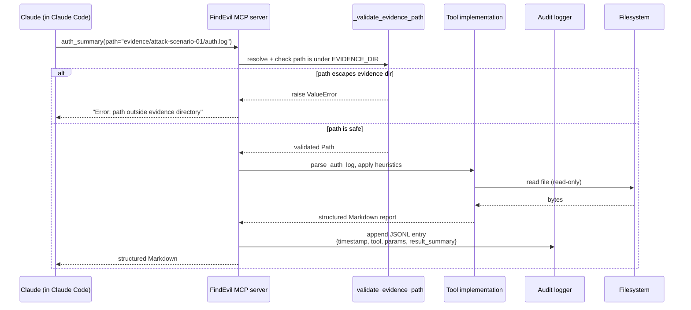

# FindEvil Architecture

## Architectural pattern

**Custom MCP Server** (option 2 of the four architectures listed in the
hackathon brief). We chose this over Direct Agent Extension because:

- **Guardrails are architectural, not prompt-based.** Claude cannot modify
  evidence because no write-capable tool is exposed. This is the
  distinction the "Constraint Implementation" judging criterion rewards.
- **Output shape is enforced.** Tools return pre-parsed, structured
  Markdown with line-number provenance. Claude never sees a 10k-line `vol.py`
  dump, which eliminates a major class of hallucination.
- **Auditability is mechanical.** Every tool call is persisted to
  `logs/audit.json` by the server, independent of Claude's own tracking.
  Judges can trace any finding in a report back to the specific tool call
  that produced it.

## System diagram

```mermaid
flowchart TB
    subgraph User[User / IR Analyst]
        prompt["Investigate evidence at .../attack-scenario-01"]
    end

    subgraph ClaudeCode[Claude Code - SIFT Workstation]
        agent[Claude Opus<br/>autonomous agent loop]
        writer[Built-in Write tool<br/>allow-listed paths only:<br/>./analysis ./reports ./exports]
    end

    subgraph FindEvil[FindEvil MCP Server stdio subprocess]
        direction TB
        entry[__main__.py<br/>python -m findevil]
        mcp["FastMCP instance<br/>45 typed tools"]
        guard["_validate_evidence_path<br/>rejects paths outside FINDEVIL_EVIDENCE_DIR"]
        audit["_audit JSON lines<br/>FINDEVIL_LOGS_DIR/audit.json"]

        subgraph Tools[Tool modules — 14 domain groups]
            direction TB
            core["server.py (6)<br/>file_info, hash_file,<br/>strings_extract, hexdump,<br/>list_evidence, log_search"]
            auth["linux_auth.py (5)<br/>auth_summary, auth_failed_logins,<br/>auth_successful_logins,<br/>auth_sudo_commands, auth_user_events"]
            journal["linux_journal.py (1)<br/>analyze_journal"]
            persist["linux_persistence.py (5)<br/>find_persistence, analyze_systemd_unit,<br/>analyze_authorized_keys, analyze_sshd_config,<br/>analyze_sudoers"]
            shell["linux_shell_history.py (2)<br/>find_shell_histories,<br/>analyze_bash_history"]
            web["linux_web.py (2)<br/>analyze_nginx_access, find_webshells"]
            pkg["linux_packages.py (2)<br/>analyze_package_logs,<br/>verify_package_integrity"]
            cont["linux_containers.py (1)<br/>analyze_container_artifacts"]
            timeline["linux_timeline.py (4)<br/>stat_file, find_recent_changes,<br/>find_timestamp_anomalies, build_timeline"]
            fim_mod["fim.py (2)<br/>baseline_create, baseline_diff"]
            selfc["self_correction.py (3)<br/>verify_finding, find_contradictions,<br/>get_audit_trail"]
            auton["autonomy.py (2)<br/>assess_coverage,<br/>finalize_report (self-correction gate)"]
            ti["threat_intel.py (2)<br/>extract_iocs, bulk_ioc_lookup"]
            ai["ai_signatures.py (1)<br/>find_ai_signatures"]
            mem["linux_memory.py (7)<br/>analyze_memory_summary, _processes,<br/>_network, _modules, _bash_history,<br/>_malfind, correlate_memory_and_disk"]
        end
    end

    subgraph Evidence[Evidence directory READ-ONLY]
        direction LR
        log[auth.log]
        fs[fs/ snapshot<br/>etc/, home/, root/]
    end

    subgraph Reports[./reports READ-WRITE]
        direction LR
        irreport[Incident Report markdown]
    end

    subgraph Logs[./logs READ-WRITE]
        direction LR
        auditlog[audit.json JSONL]
    end

    prompt --> agent
    agent <-->|MCP stdio<br/>typed calls + structured results| mcp
    entry --> mcp
    mcp --> Tools
    Tools --> guard
    guard -.reads.-> Evidence
    Tools --> audit
    audit --> auditlog
    agent -->|Write tool| writer
    writer -->|allow-listed| irreport

    classDef readonly fill:#ffe4e1,stroke:#c00,color:#000
    classDef readwrite fill:#e8f5e9,stroke:#080,color:#000
    class Evidence readonly
    class Reports,Logs readwrite
```



## Data flow for a single tool call



## Autonomous investigation loop

The per-domain tools are *capabilities*; the `autonomy.py` module supplies
the *control structure* that makes the agent investigate like an analyst
from a single "investigate this evidence" prompt — no per-step human
direction. The server's standing `instructions` (and `CLAUDE.md`) define
the loop:

```
ORIENT      list_evidence
   │
INVESTIGATE run typed tools; on any IOC, PIVOT (extract_iocs /
   │        bulk_ioc_lookup + cross-evidence search) before moving on
   ▼
ASSESS      assess_coverage(findings)  ← gaps computed from logs/audit.json:
   │        unexamined artifacts · un-pivoted IOCs · unverified CONFIRMED
   │        gaps remain ─► back to INVESTIGATE
   ▼  COVERAGE CLEAN
FINALIZE    finalize_report(claims)    ← the self-correction GATE
            rejects any CONFIRMED claim that fails verify_finding or
            contradicts another ─► agent re-investigates or downgrades,
            then resubmits.  Only ACCEPTED claims may be stated CONFIRMED.
```

Two properties make this autonomous rather than scripted:

- **"What's left to do" is mechanical, not remembered.** `assess_coverage`
  derives gaps from the audit trail + the evidence inventory, so the agent
  cannot hallucinate that it is finished.
- **Self-correction is enforced, not requested.** `finalize_report` is the
  only sanctioned way to emit conclusions and it can say no. The loop's
  termination condition (coverage clean *and* finalize accepted) is the
  same condition the headless `scripts/investigate.py` checks mechanically
  between iterations.

## Security boundaries

Three distinct enforcement layers, from hardest to softest:

1. **MCP server — architectural** (most rigid). No write-capable tool
   exists for any path under `FINDEVIL_EVIDENCE_DIR`. `_validate_evidence_path`
   is called in every tool entrypoint before any file operation. A prompt
   injection cannot talk FindEvil's tools into spoliating evidence because
   there is no such tool to call. **The same principle applies to
   conclusions: `finalize_report` is the only tool that emits a verdict,
   and it architecturally rejects an unverified CONFIRMED claim — so an
   unsound "CONFIRMED" finding cannot be shipped any more than evidence can
   be modified.**

2. **Claude Code `settings.json` — allow-list** (inherited from Protocol
   SIFT starter). Built-in Claude tools (`Write`, `Edit`, raw `Bash`) are
   scoped to `./analysis/`, `./reports/`, `./exports/` only, never the
   evidence path. This is a strong but policy-based control — it lives in
   a config file the judges can inspect.

3. **Agent prompt / `CLAUDE.md` — guidance** (softest). Inherited from
   Protocol SIFT: "Never modify files in evidence directories." This is a
   defence-in-depth backstop, but is not trusted alone.

## Tool inventory (45)

The full table — 45 typed `@mcp.tool()` functions across 14 modules —
lives in [the project README](../README.md#tool-inventory-45). The
diagram above already shows the per-module breakdown. Every tool
returns Markdown with per-finding line-number references where
applicable, so any claim in an IR report can be traced back to the
raw evidence.

## Why this is fast enough

Hackathon motivation: attackers operate at machine speed, defenders don't.
The big speedup comes from the agent loop itself (parallel autonomous tool
calls vs sequential human analysis), but FindEvil's architecture also
helps:

- **Structured outputs** use far fewer tokens than raw bash dumps. On the
  scenario 01 auth log (120 lines), `auth_summary` returns ~15 lines of
  structured Markdown vs ~2,400 characters of raw `grep` output. That
  means less prompt context consumed per tool call, which in turn means
  faster LLM inference.
- **Evidence integrity checks are local**: `_validate_evidence_path`
  resolves via `pathlib` — no network, no disk writes on the hot path.
- **Tool calls can run in parallel** via the agent's multi-tool-call
  capability; the server is stateless per call.
